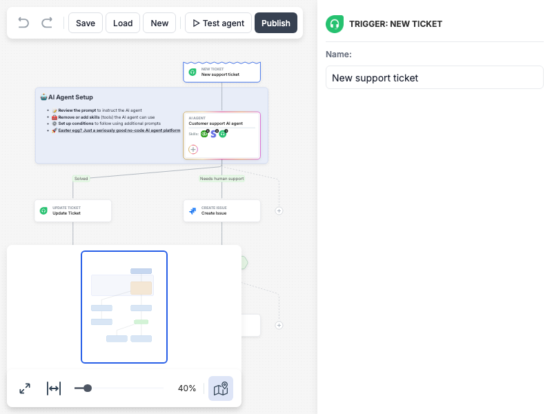

# JointJS+: AI Agent Builder 

Enable your users to design AI agents through an interactive, drag-and-drop interface built right into your web app. This demo showcases how they can visually build AI-driven workflows, integrate third-party apps, add logic blocks, and define behaviors—all within a smooth, intuitive experience. With pre-built UI features like automatic layout, custom shapes, and navigator, you can transform your app into a modern, AI-first solution.

This demo is also available online at [jointjs.com](https://jointjs.com/demos/ai-agent-builder).

## Available Versions

- [JavaScript](./js/)
- [TypeScript](./ts/)

## Screenshot

