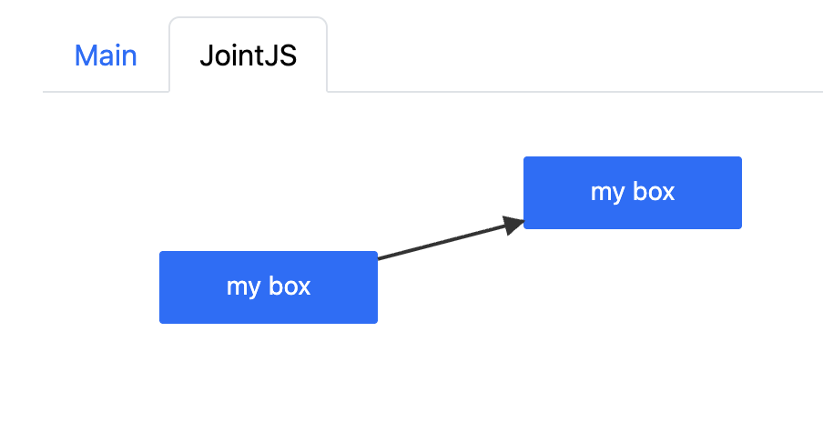

# JointJS: Bootstrap Tabs

Need to create multiple Bootstrap Tabs while displaying and manipulating diagram content? The following demo shows how to integrate Bootstrap Tabs with JointJS. The first tab displays a button for translating a JointJS element, and this translation is reflected in the diagram on the second tab.

## Available Versions

- [JavaScript](./js/)

## Screenshot

