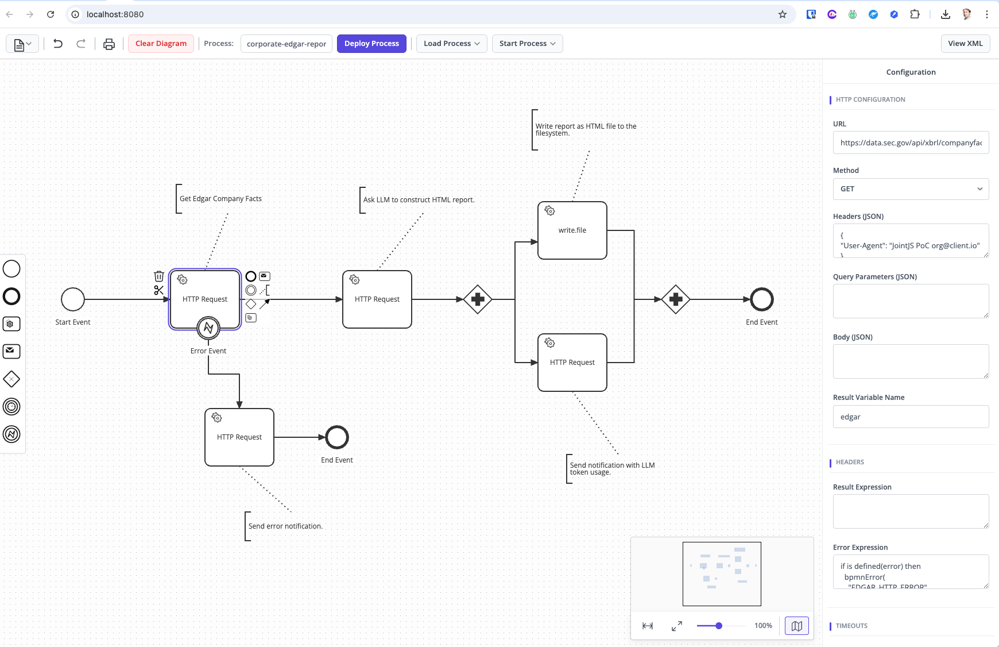
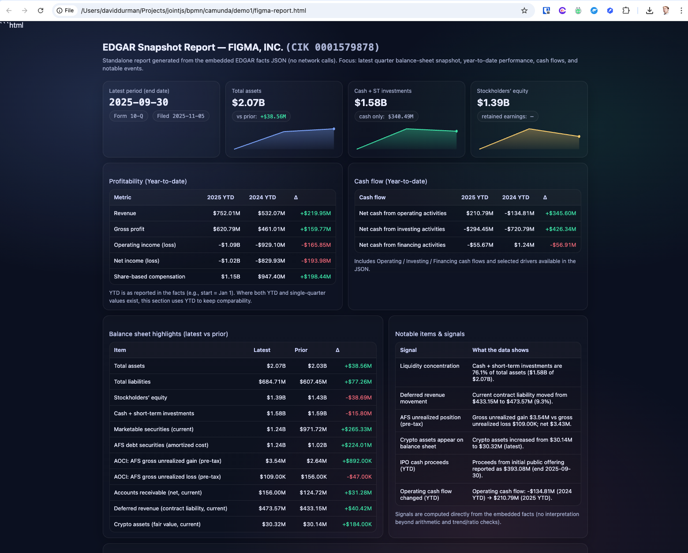
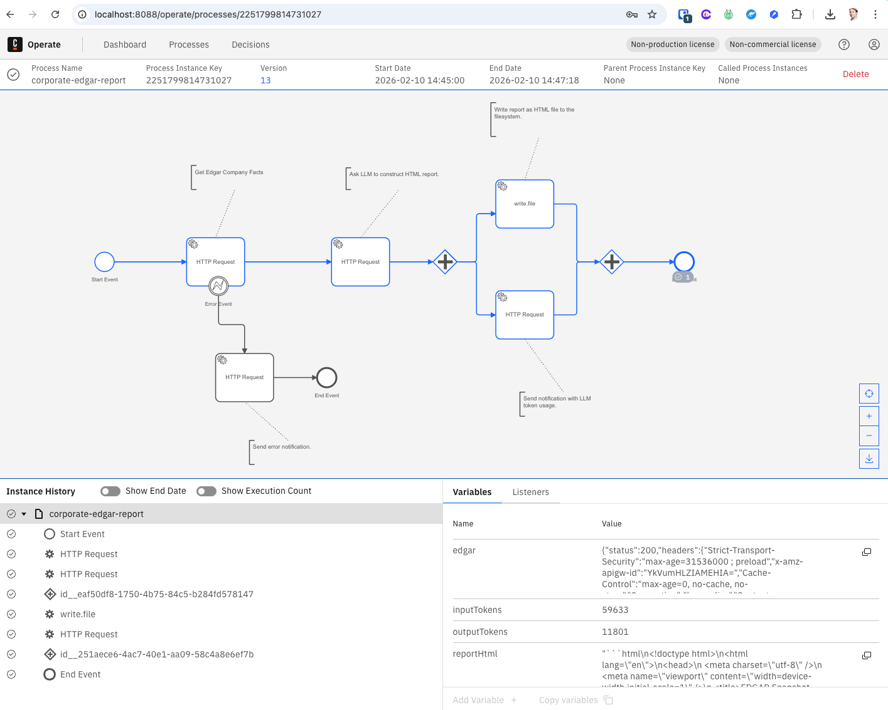

# JointJS+: BPMN Camunda Integration (JavaScript) <a href="https://www.jointjs.com/jointjs-plus"></a>

This PoC demonstrates how a **JointJS-based BPMN modeler UI** can be integrated with the **Camunda 8 (Zeebe) engine** to design, deploy, and execute real BPMN workflows.

The goal is to show how a **domain-focused BPMN editor** can generate **Camunda-compatible, executable BPMN** while hiding engine-specific complexity from end users.

## How to download this demo

You can download this demo using our [`@joint/cli` tool](https://www.npmjs.com/package/@joint/cli):

```bash
npx @joint/cli download bpmn-camunda-integration/js
```

Alternatively, you can get the [copy of the repository](https://github.com/clientIO/joint-demos/archive/refs/heads/main.zip) from GitHub as usual.

## Screenshots

JointJS domain specific BPMN modeler:



Result of the Sample process, generated financial report:



Camunda Operate UI showing the sample process instance:



## Running the application

To run this application you need to have access to JointJS+ package. You can get it by having a JointJS+ license or by starting a [free trial](https://www.jointjs.com/free-trial).

If you are a trial user, you received your access token during the trial sign-up process.
If you are a customer, log in to the customer portal at https://my.jointjs.com to obtain your access token.

This example uses `.npmrc` file to set up access to the JointJS+ private npm registry. By default it uses `JOINTJS_NPM_TOKEN` environment variable to get authentication token. You can set this environment variable in your terminal or CI environment in the following way:

**macOS / Linux**:
```sh
export JOINTJS_NPM_TOKEN="jjs-xxxxxxxx-xxxx-xxxx-xxxx-xxxxxxxxxxxx"
```

**Windows (PowerShell)**:
```sh
$env:JOINTJS_NPM_TOKEN="jjs-xxxxxxxx-xxxx-xxxx-xxxx-xxxxxxxxxxxx"
```

Learn more about our [private npm registry here.](https://docs.jointjs.com/learn/help-center/npm-registry)

### Prereqs

* Docker + Docker Compose (v1.27+).
* NodeJS

### Start Camunda 8 locally (Docker Compose full)

**Download the official Docker Compose bundle**

https://docs.camunda.io/docs/self-managed/quickstart/developer-quickstart/docker-compose/

**Start the full stack**

From the extracted directory:
```
docker compose -f docker-compose-full.yaml up -d
```

**Default URLs + login**

Once it’s up, you can log in with:
* Username: demo
* Password: demo

Key UIs (for this PoC):
* Operate: http://localhost:8088/operate
* Identity: http://localhost:8088/identity

### Run the PoC server (Node.js)

```
npm install
npm start
```

### Run the JointJS based modeler UI:

```
cd modeler/
npm install
npm start
```

`npm start` runs the Webpack bundle. Resulted js files are being hosted by webpack-dev-server.

Due to Same-Origin policy implemented in the majority of browsers to prevent content from being accessed if the file exists on another domain, it is recommended to access the application through a **Web server**. The application might work only partially when viewed from a file-system location.

---

## What this PoC shows

- Modeling BPMN processes using a **custom JointJS-based UI**
- Exporting BPMN XML and adapting it for **Camunda 8 / Zeebe execution**
- Deploying processes programmatically to Zeebe
- Starting process instances and observing execution in **Camunda Operate**
- Executing real integrations using Camunda’s **HTTP (REST) Outbound Connector**
- Handling success vs error paths using:
  - BPMN gateways (e.g. Exclusive, Parallel)
  - Boundary error events
  - FEEL expressions
- Demonstrating retry behavior vs business error handling

---

## Key design principles

- **Standards-first modeling**  
  BPMN is used for control flow and orchestration.

- **Engine-specific execution**  
  Camunda/Zeebe-specific details (e.g. `zeebe:*` extensions, retries, error handling) are added at export/deploy time.

- **Curated BPMN subset**  
  The editor exposes only elements that are executable and meaningful in Camunda 8.

- **No dependency on Camunda Modeler**  
  Processes are deployed directly to Zeebe and observed via Operate.

---

## Architecture overview

```
JointJS BPMN Editor (Browser)
↓
Node.js API
↓
Zeebe (Camunda 8)
↓
Operate (Runtime UI)
```

---

## What this PoC is *not*

- A replacement for Camunda Modeler
- A full BPMN feature implementation

---

## Why this matters

Many teams want:
- BPMN modeling tailored to their domain
- A simpler UX than generic BPMN tools
- Direct integration with a production-grade workflow engine

This PoC shows how **JointJS can be used to build such a modeler** while remaining compatible with **Camunda 8 execution semantics**.

---

## Status

Proof of Concept / Demo  
Not intended for production use.
