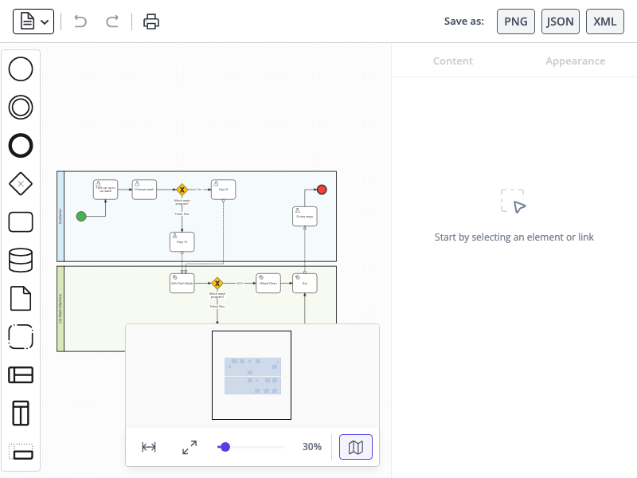

# JointJS+: BPMN Editor 

The BPMN demo app showcases a standardized method of modeling a business process from beginning to end. It's written in TypeScript but can be seamlessly integrated with React, Vue, Angular, Svelte, or LightningJS.

This demo is also available online at [jointjs.com](https://jointjs.com/demos/bpmn-editor).

## Available Versions

- [JavaScript](./js/)
- [TypeScript](./ts/)

## Screenshot

