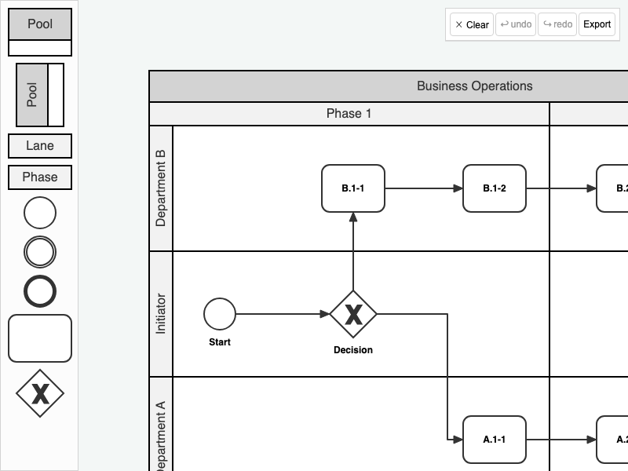

# JointJS+: BPMN Pools, Swimlanes & Milestones 

Experience an enhanced implementation of BPMN Pools, Swimlanes, and Milestones that utilizes the drag & drop feature for an improved user experience. This demo demonstrates how to interact with swimlanes and phases, including how to insert new ones, reorder, and resize them, with automatic adjustments based on content. Additionally, explore other useful features like content awareness, which prevents swimlanes and milestones from being resized beyond their content boundaries. The demo also includes previews and highlights to clarify the outcomes of your actions, such as highlighting target lanes and phases for dropping items.

This demo is also available online at [jointjs.com](https://jointjs.com/demos/bpmn-pools-swimlanes-milestones).

## Available Versions

- [JavaScript](./js/)
- [TypeScript](./ts/)

## Screenshot

