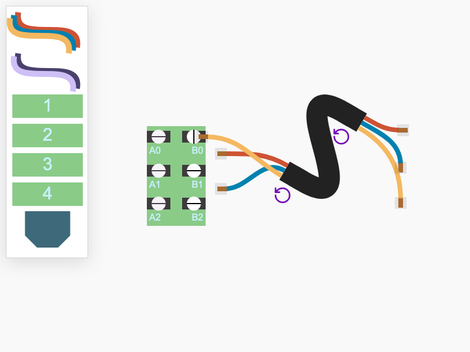

# JointJS+: Cables 

Need to create interactive wiring diagrams? Explore our Cables demo, built with JointJS+ and TypeScript. It features custom elements like multi-wire cables, screw terminals, and plugs, demonstrating how JointJS+ simplifies the modeling of intricate systems through intuitive drag-and-drop interactions.

This demo is also available online at [jointjs.com](https://jointjs.com/demos/cables).

## Available Versions

- [JavaScript](./js/)
- [TypeScript](./ts/)

## Screenshot

