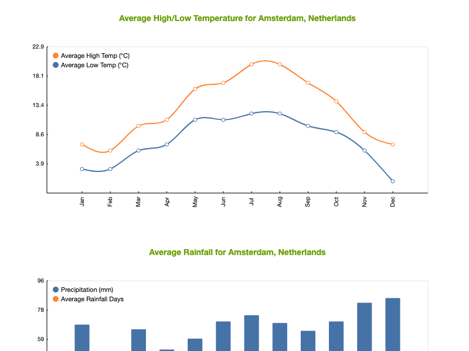

# JointJS+: Charts 

The Charts demo showcases how to create Line, Bar, Area, Combo charts, Pie & Donut charts, and Knobs in JointJS applications. From the JointJS perspective, these charts are just another JointJS element, and therefore can be manipulated as any other element (resized, rotated, connected to other elements, serialized to/from JSON, etc).

This demo is also available online at [jointjs.com](https://jointjs.com/demos/charts).

## Available Versions

- [JavaScript](./js/)
-

## Screenshot

