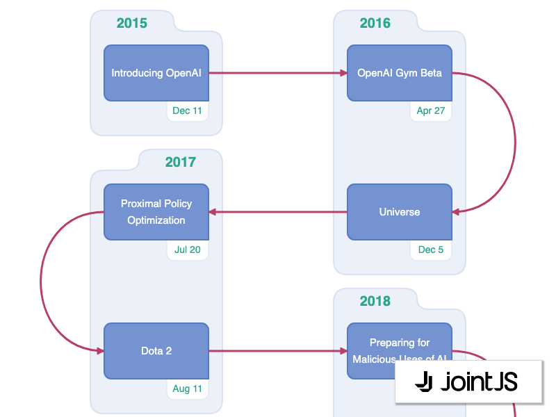

# JointJS: OpenAI (ChatGPT) Timeline

This demo shows a serpentine layout used on a real application: OpenAI (ChatGPT) timeline. It also utilizes the convex hull algorithm to help add tight outlines around a group of related elements. Delve into the history of this groundbreaking AI technology with this interactive visualisation.

This demo is also available online at [jointjs.com](https://jointjs.com/demos/chatgpt-timeline).

## Available Versions

- [JavaScript](./js/)

## Screenshot

