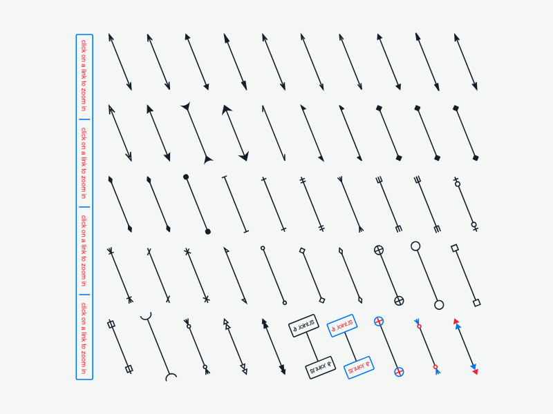

# JointJS: Connector Arrows

Explore our collection of connector arrows, including those for special diagram types such as BPMN, UML, or those you may be familiar with from Visio or similar applications. The collection was created using JointJS, our open-source diagramming library, so feel free to grab the source code and use any of these connector arrows in your project.

This demo is also available online at [jointjs.com](https://jointjs.com/demos/connector-arrows).

## Available Versions

- [JavaScript](./js/)

## Screenshot

