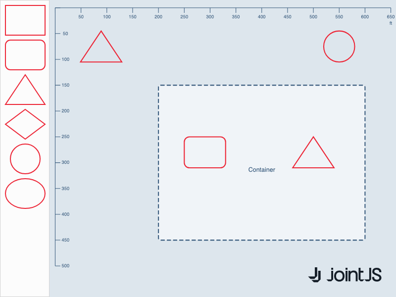

# JointJS+: Container distance guides 

This demo extends the [alignment and distance-based position guides](../alignment-and-distance-based-position-guides/) demo with container elements. When an element is dragged inside a container, it shows distance guides to the container walls, with sibling elements taking priority over walls.

This demo is also available online at [demos.jointjs.com](https://demos.jointjs.com/container-distance-guides).

## Available Versions

- [JavaScript](./js/)

## Screenshot

