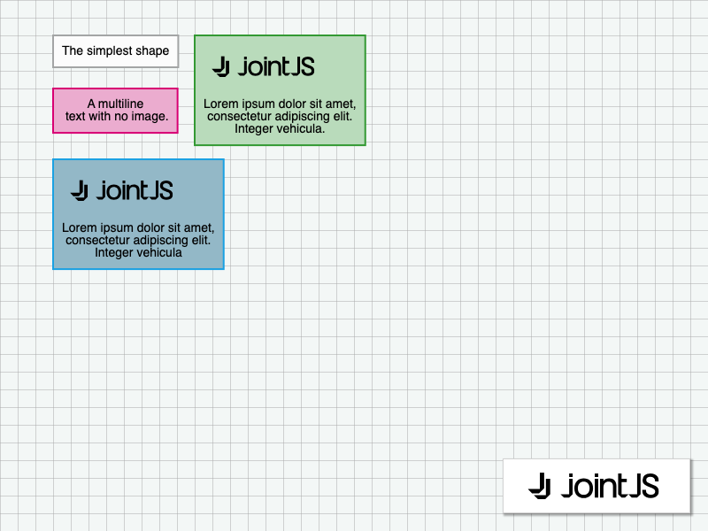

# JointJS: Content Driven Shapes

Wondering how to dynamically resize elements based on their content? Take a look at this demo that shows exactly that.

This demo is also available online at [jointjs.com](https://jointjs.com/demos/content-driven-shapes).

## Available Versions

- [JavaScript](./js/)

## Screenshot

