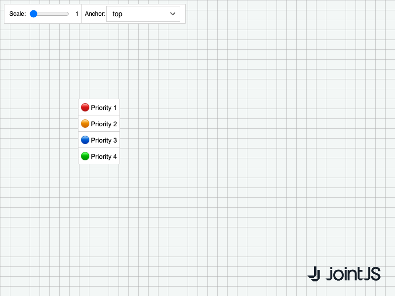

# JointJS+: ContextToolbar 

Need to change the scale or position of a context menu? See how you can adjust its appearance using the context toolbar.

This demo is also available online at [jointjs.com](https://jointjs.com/demos/context-toolbar).

## Available Versions

- [JavaScript](./js/)

## Screenshot

