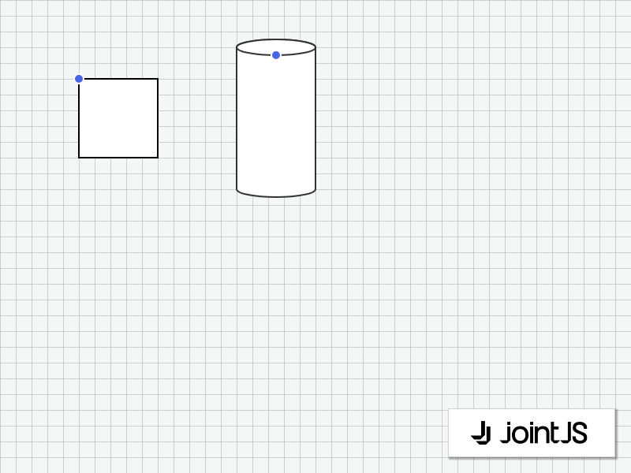

# JointJS: Control Tool

This demo shows the JointJS control tool that lets you change the element shape in a drag and drop fashion.

This demo is also available online at [jointjs.com](https://jointjs.com/demos/control-tool).

## Available Versions

- [JavaScript](./js/)

## Screenshot

