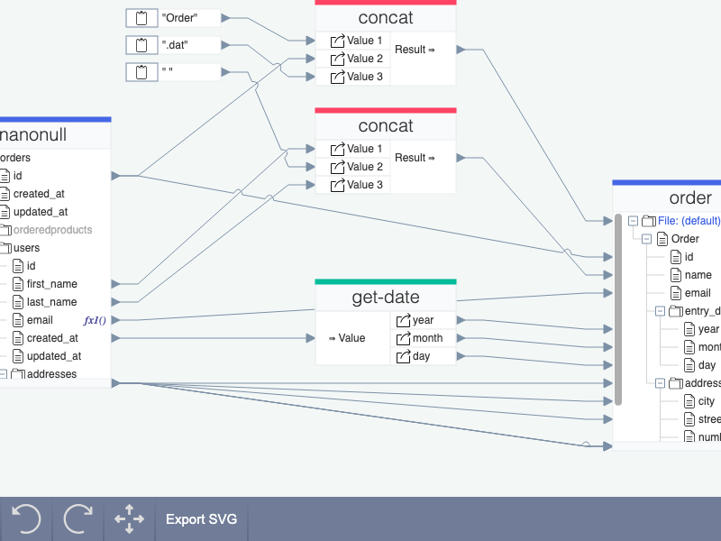

# JointJS+: Data Mapping 

The Data mapping application is a helpful example of JointJS+ that highlights some of the prebuilt features such as exporting to SVG or linking diagram elements. The demo below allows you to map abstract data that is provided in a given format and experience the power of JointJS+.

This demo is also available online at [jointjs.com](https://jointjs.com/demos/data-mapping).

## Available Versions

- [JavaScript](./js/)
- [TypeScript](./ts/)

## Screenshot

