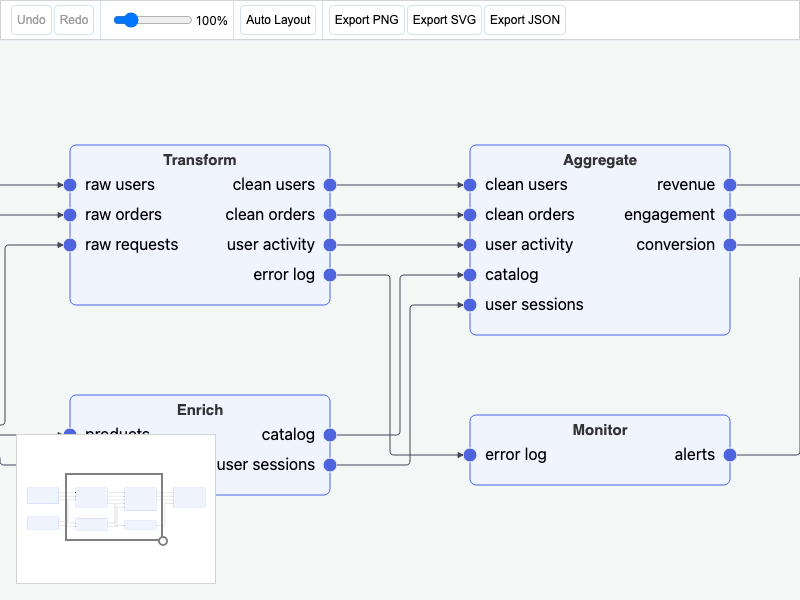

# JointJS: Data Pipeline

This demo demonstrates a data pipeline builder using JointJS with automatic orthogonal link routing powered by the libavoid WASM library.

This demo is also available online at [demos.jointjs.com](https://demos.jointjs.com/data-pipeline).

## Available Versions

- [Angular](./angular/)

## Screenshot

