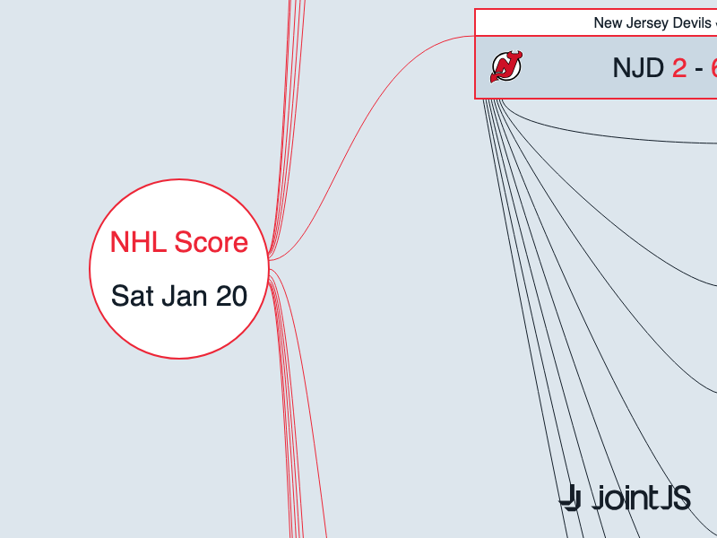

# JointJS+: Diagram Generation from External Data (NHL Score) 

Learn how to create impressive diagrams from REST API data, demonstrated on NHL match data! See how to use curved links with tree layouts and how to seamlessly add images to existing shapes. Explore the demo to see a visual representation of external data in action using JointJS+.

This demo is also available online at [jointjs.com](https://jointjs.com/demos/diagram-generation-from-external-data).

## Available Versions

- [JavaScript](./js/)

## Screenshot

