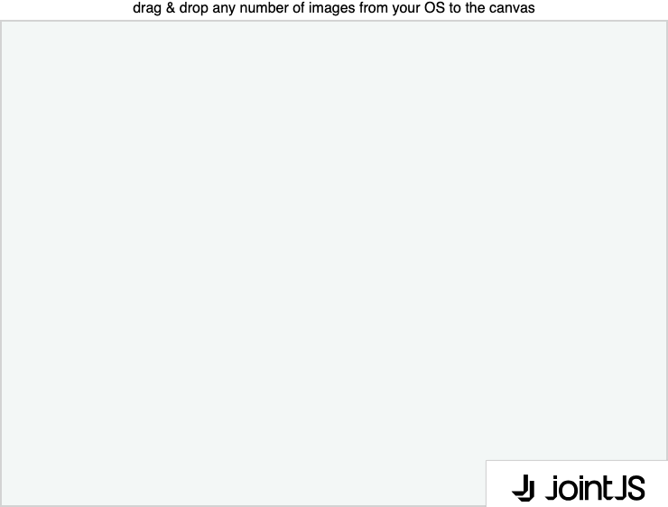

# JointJS: Drop image as shape

Do you want users to be able to drag and drop an image from their operating system directly into a diagram and turn it into an interactive element? This demo shows how it could be done.

This demo is also available online at [jointjs.com](https://jointjs.com/demos/drop-image-as-shape).

## Available Versions

- [JavaScript](./js/)

## Screenshot

