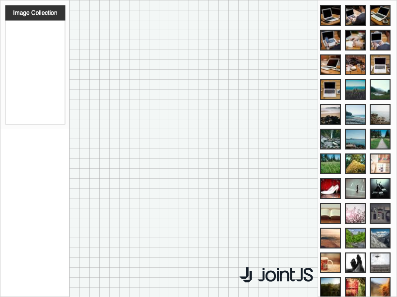

# JointJS+: Drop stencil element as shape icon 

Do you need to fetch data and transform it into a palette of elements? Looking for a way to intercept the default stencil behavior and replace it with your own? E.g. to drop a stencil element as a model property instead of a new graph element. If so, this demo is for you.

This demo is also available online at [jointjs.com](https://jointjs.com/demos/drop-stencil-element-as-shape-icon).

## Available Versions

- [JavaScript](./js/)

## Screenshot

