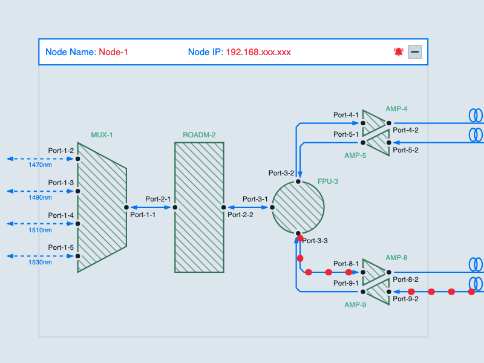

# JointJS: DWDM Circuit

DWDM circuits (Dense wavelength-division multiplexing) are frequently utilized in long-distance telecommunications networks to enable the effective transmission of substantial data volumes across extended distances. Moreover, they find application in various domains including cable TV and internet service providers, facilitating the transmission of numerous signals through a solitary fiber optic connection. Explore this demo to familiarize yourself with this concept, and feel free to grab its source code if you need to create a graphical visualization of such a data transmission.

## Available Versions

- [TypeScript](./ts/)

## Screenshot

