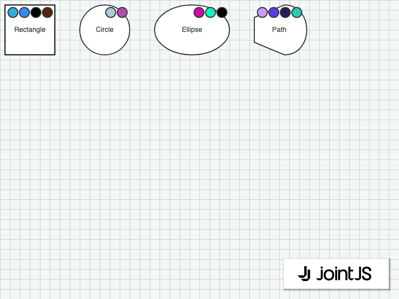

# JointJS: Dynamic Status Icons

Need to indicate a particular status dynamically? When working with highlighters, we can add a list of arbitrary SVG elements to the cell view, and then update this list in the manner we want.

This demo is also available online at [jointjs.com](https://jointjs.com/demos/dynamic-status-icons).

## Available Versions

- [JavaScript](./js/)

## Screenshot

