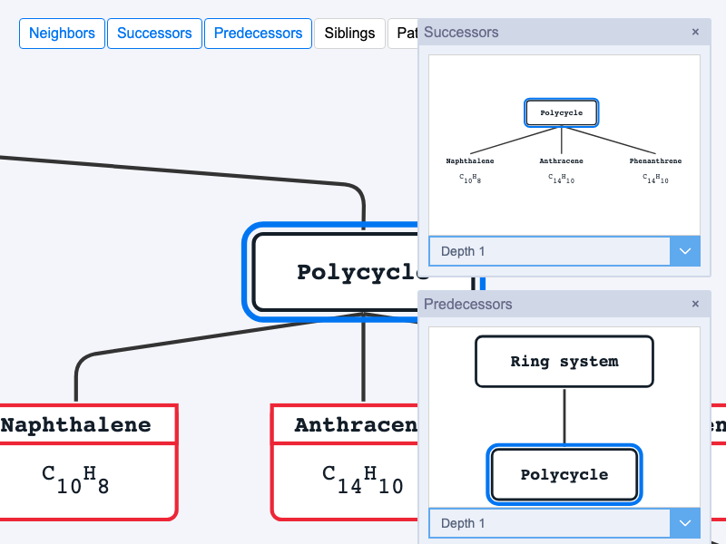

# JointJS+: Element Neighborhood Dialog Window 

When working with a large number of objects, it is useful to activate a local view and drill down into the surroundings of a specific element. In this demo, we show you multiple element relationships and local views: Neighbors, Successors, Predecessors, Siblings and Path from Element, all displayed as a floating popup that can be freely placed anywhere on the paper. In addition, the demo shows how to incorporate subscript and superscript into HTML.

This demo is also available online at [jointjs.com](https://jointjs.com/demos/element-neighborhood-dialog-window).

## Available Versions

- [JavaScript](./js/)

## Screenshot

