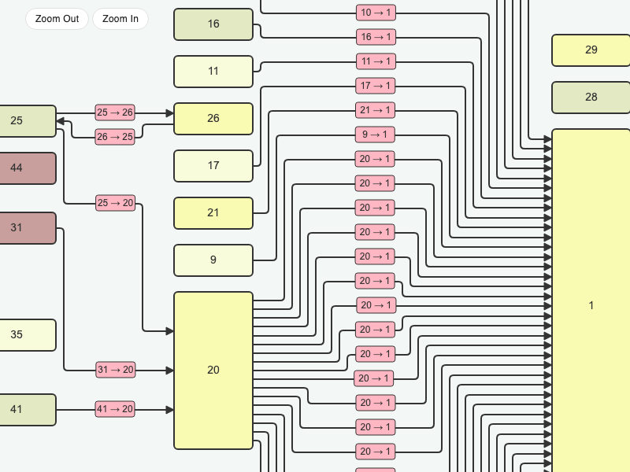

# JointJS: ELK Layout

This ELK Layout demo is built with TypeScript and shows how to use the elkjs library together with JointJS to create automatic diagram layouts powered by the Eclipse Layout Kernel (ELK).

## Available Versions

- [TypeScript](./ts/)

## Screenshot

