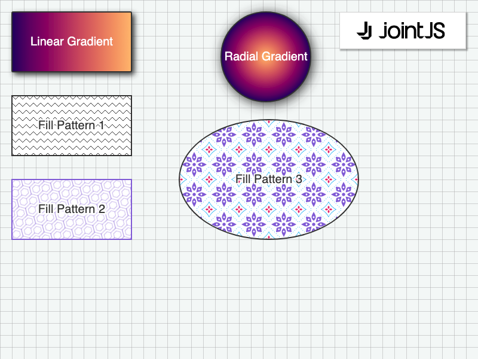

# JointJS: Fills

Do you want to use different visual patterns to fill the elements of the diagram? Check out this JointJS demo that shows several elements with different visual fills.

This demo is also available online at [jointjs.com](https://jointjs.com/demos/fills).

## Available Versions

- [JavaScript](./js/)

## Screenshot

