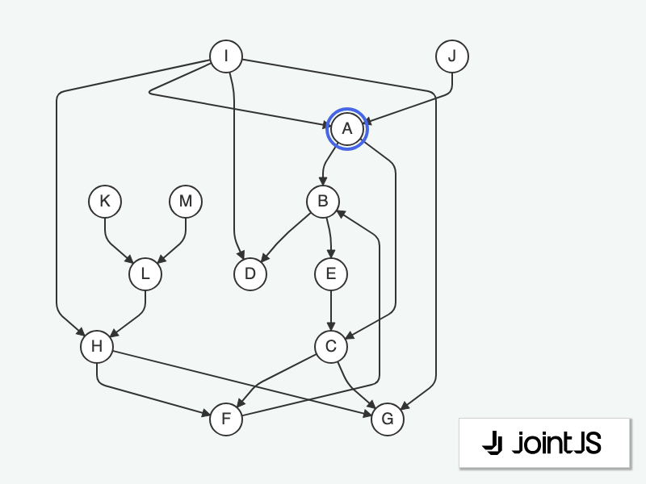

# JointJS: Find All Cells Between 2 Elements

How to highlight all cells between 2 given elements? Check out this demo to see how we use the graph API to find cells, and utilize highlighters to present the result to the user.

This demo is also available online at [jointjs.com](https://jointjs.com/demos/find-all-cells-between-2-elements).

## Available Versions

- [JavaScript](./js/)

## Screenshot

