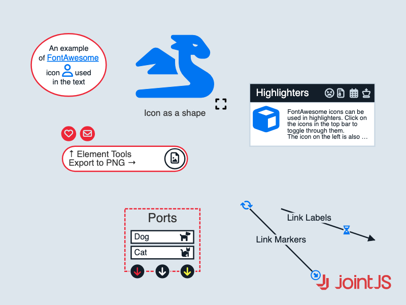

# JointJS+: Font Awesome 

This interactive demo shows how to use Font Awesome (or any other icon library) together with JointJS, how to add icons to elements, ports, links, or tools, and how to export a diagram that uses an external font to a standalone SVG or PNG image.

This demo is also available online at [jointjs.com](https://jointjs.com/demos/font-awesome).

## Available Versions

- [JavaScript](./js/)

## Screenshot

