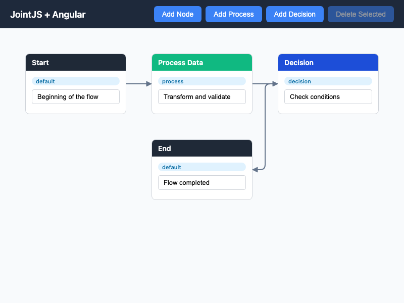

# JointJS: Framework Element View

This demo demonstrates how to integrate JointJS with UI frameworks by rendering framework components inside custom element views.

This demo is also available online at [demos.jointjs.com](https://demos.jointjs.com/framework-element-view).

## Available Versions

- [Angular](./angular/)

## Screenshot

