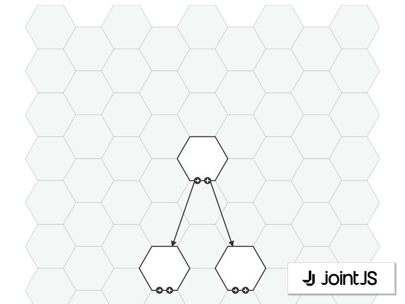

# JointJS: Hexagonal Grid

How would you create a hexagonal grid diagram? We used the Honeycomb library to do the math for us, and JointJS, which rendered the grid and the shapes in it and made everything interactive. Check out the result below.

This demo is also available online at [jointjs.com](https://jointjs.com/demos/hexagonal-grid).

## Available Versions

- [JavaScript](./js/)

## Screenshot

