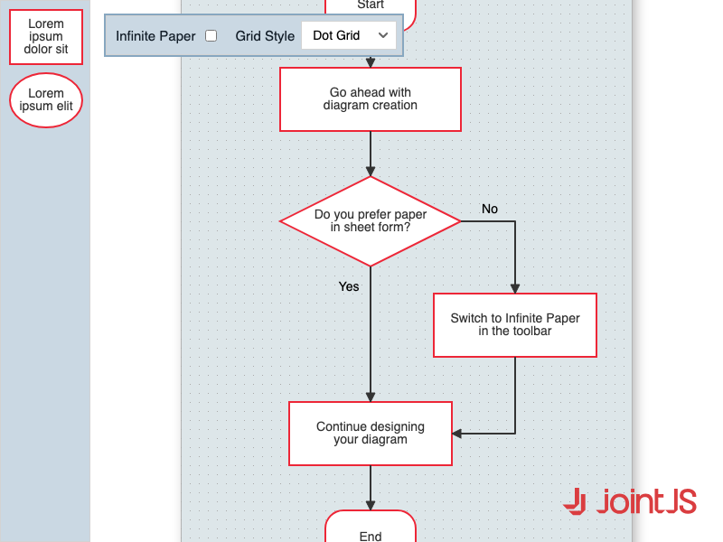

# JointJS+: Infinite Paper vs. Sheets 

In JointJS+, various methods exist for determining the paper size. One option involves arbitrary definition, while another allows for dynamic adjustments when an element exceeds its boundary. The canvas dimensions can be specified as a singular sheet or as multiple sheets with distinct borders. This proves particularly effective when utilized alongside the print function. Alternatively, users can opt for an infinite paper approach, which lacks defined borders. To gain a deeper understanding of these techniques, we invite you to explore our interactive demo below, where both approaches can be experimented with.

This demo is also available online at [jointjs.com](https://jointjs.com/demos/infinite-paper-vs-sheets).

## Available Versions

- [JavaScript](./js/)

## Screenshot

