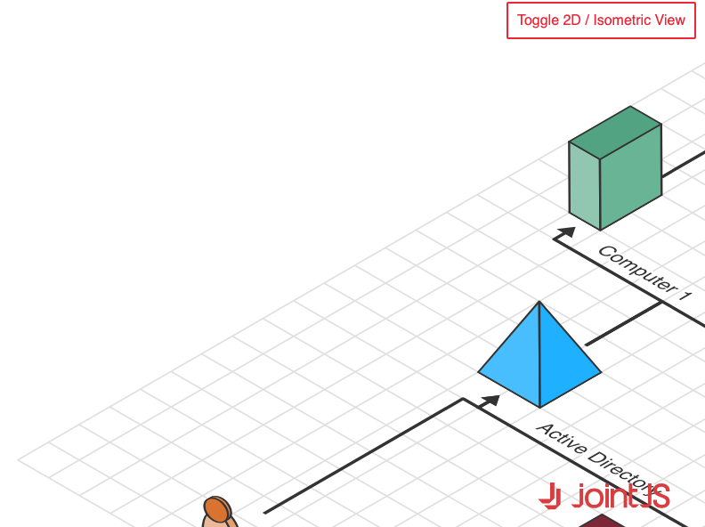

# JointJS: Isometric Diagram

We have developed a demo of an isometric diagram using various methods and techniques. The utilization of JointJS enables seamless transitioning between 2D and isometric SVG markup for each element. Thanks to its robust capabilities, we can design tools to modify isometric objects, relocate them, and establish connections using links. All actions that are possible in a 2D environment, but now in an isometric perspective.

## Available Versions

- [TypeScript](./ts/)

## Screenshot

