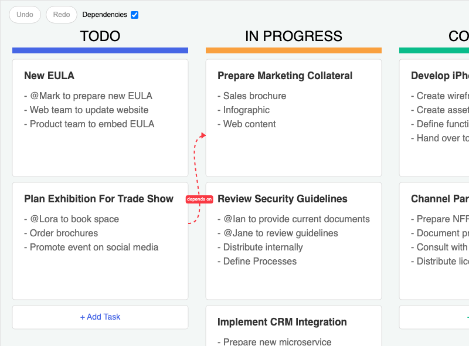

# JointJS+: Kanban 

The demo displays the popular Kanban board diagram type. It's written in JavaScript, but can be easily integrated with TypeScript, React, Vue, Angular, Svelte, or LightningJS.

This demo is also available online at [jointjs.com](https://jointjs.com/demos/kanban).

## Available Versions

- [JavaScript](./js/)
- [TypeScript](./ts/)

## Screenshot

