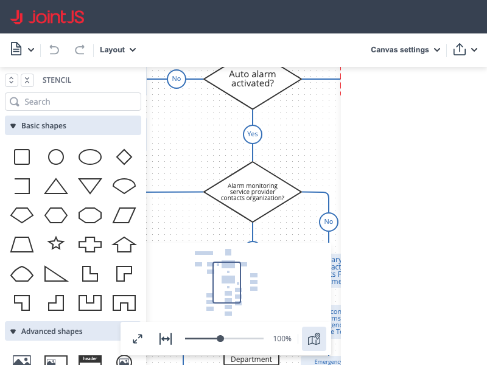

# JointJS+: Kitchen Sink App 

This demo, as the name suggests, presents all the main features of JointJS+ and is a useful guide to understanding the capabilities of our library. You can utilize features such as exporting to PNG or SVG, interacting with the command manager, adding or removing elements, and controlling the relationships between them.

This demo is also available online at [jointjs.com](https://jointjs.com/demos/kitchen-sink).

## Available Versions

- [JavaScript](./js/)
- [TypeScript](./ts/)
- [Angular](./angular/)
- [ReactJS](./react-js/)
- [ReactTS](./react-ts/)
- [VueJS](./vue-js/)
- [VueTS](./vue-ts/)

## Screenshot

