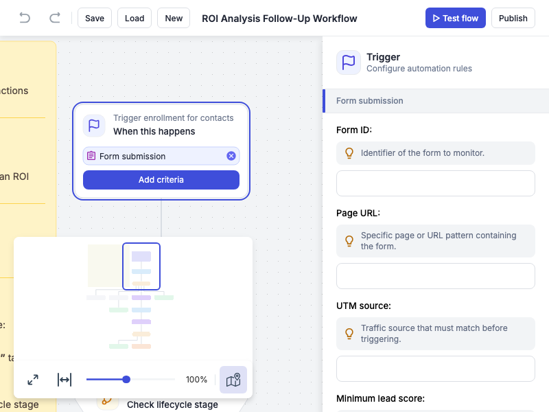

# JointJS+: Marketing Automation 

The Marketing Automation demo app lets you visually design marketing automation workflows by wiring together triggers, branches, actions, and delays. It's a practical example of how JointJS+ can be used to create visual workflow builders for business automation.

This demo is also available online at [jointjs.com](https://jointjs.com/demos/marketing-automation).

## Available Versions

- [JavaScript](./js/)
- [TypeScript](./ts/)

## Screenshot

