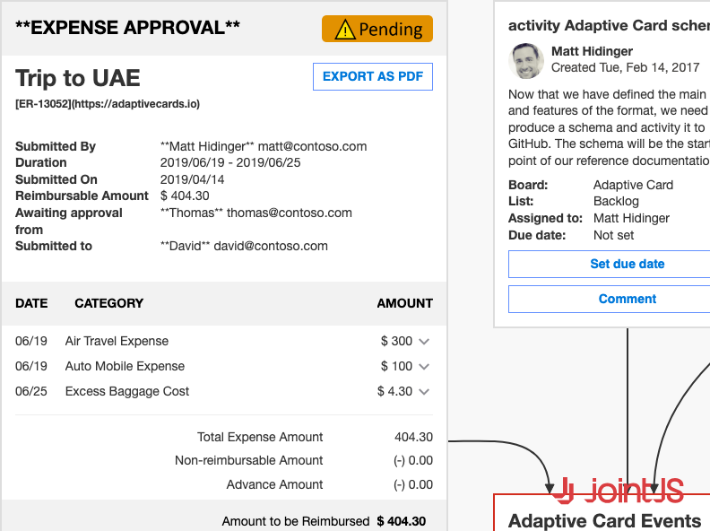

# JointJS: Microsoft Adaptive Cards

This demo implements a custom view responsible for rendering interactive HTML cards (Microsoft Adaptive Cards) inside foreign objects and synchronizing the size of the view and the model, since the size of the HTML may change over the lifetime of the card. It also demonstrates the use of the markdown language inside the shapes using the markdown-it library.

This demo is also available online at [jointjs.com](https://jointjs.com/demos/microsoft-adaptive-cards).

## Available Versions

- [JavaScript](./js/)

## Screenshot

