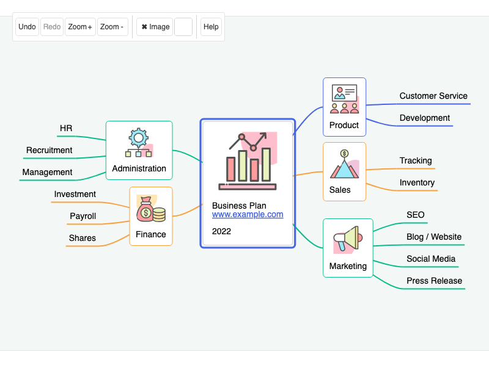

# JointJS+: MindMap 

The MindMap demo shows a diagram used to visually organize information into a hierarchy and display the relationships between them. This demo is written in JavaScript, but can be easily integrated with TypeScript, React, Vue, Angular, Svelte, or LightningJS. The source code of this demo is available as part of the JointJS+ license.

This demo is also available online at [jointjs.com](https://jointjs.com/demos/mind-map).

## Available Versions

- [JavaScript](./js/)
- [TypeScript](./ts/)

## Screenshot

