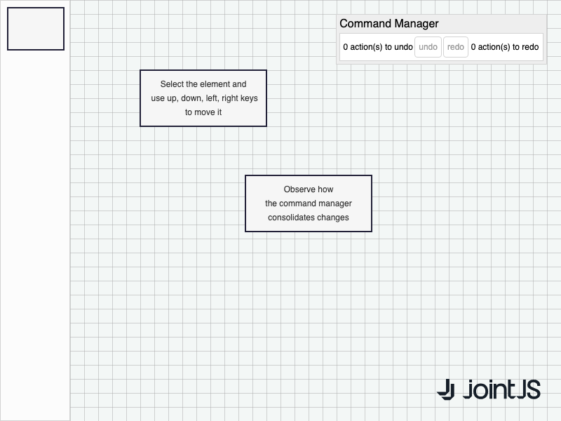

# JointJS+: Move Elements via Keyboard 

How to move selected elements using the keyboard? And how to merge a discrete sequence of moves into a single undo operation? See the demo below to get the answers.

This demo is also available online at [jointjs.com](https://jointjs.com/demos/move-elements-via-keyboard).

## Available Versions

- [JavaScript](./js/)

## Screenshot

