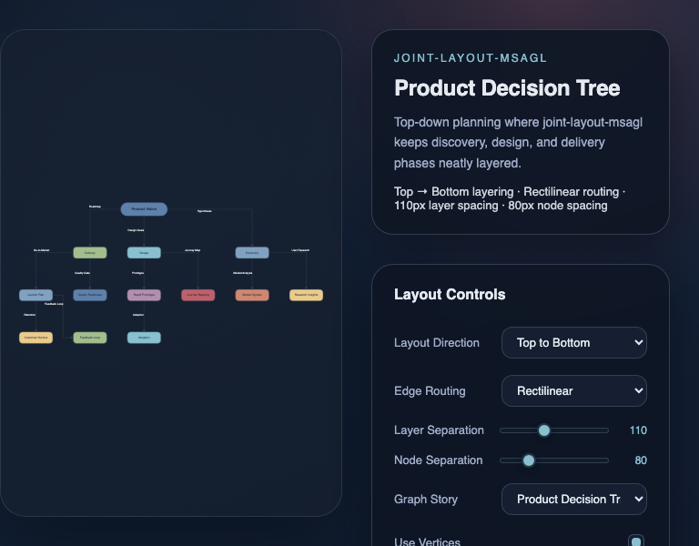

# JointJS: Microsoft Automatic Graph Layout

See how the @joint/layout-msagl, an MSAGL-powered automatic layout for JointJS keeps diagrams readable — layered positioning, rectilinear or bundled‑spline routing, adjustable separations, and animated updates.

## Available Versions

- [TypeScript](./ts/)

## Screenshot

