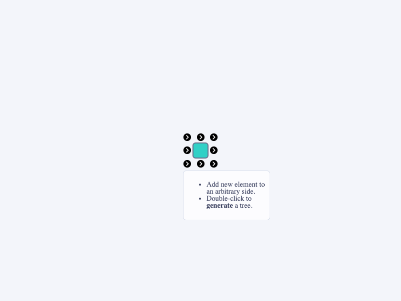

# JointJS+: Multidirectional Tree 

The Tree Graphs demo utilizes the JointJS+ TreeLayout plugin in order to create a tidy node and link diagram. Using the TreeLayout plugin shows the ease at which JointJS can layout the positions for a tree-structured graph. The source code of this demo is available as part of the JointJS+ license.

This demo is also available online at [jointjs.com](https://jointjs.com/demos/multidirectional-tree).

## Available Versions

- [JavaScript](./js/)

## Screenshot

