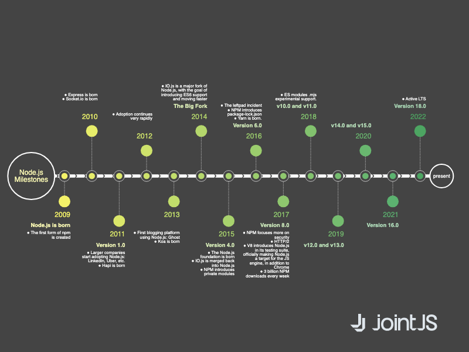

# JointJS: NodeJS Milestones Timeline

This demo shows how take advantage of link to link connections, perpendicular link anchors and custom link end markers to create a beautiful timeline diagram.

This demo is also available online at [jointjs.com](https://jointjs.com/demos/nodejs-milestones-timeline).

## Available Versions

- [JavaScript](./js/)

## Screenshot

