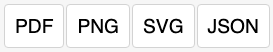

# JointJS+: PDF Export 

How to export a diagram along with other information to PDF? This demo does so with the help of the great jsPDF library and the export to canvas feature of JointJS.

This demo is also available online at [jointjs.com](https://jointjs.com/demos/pdf-export).

## Available Versions

- [JavaScript](./js/)

## Screenshot

