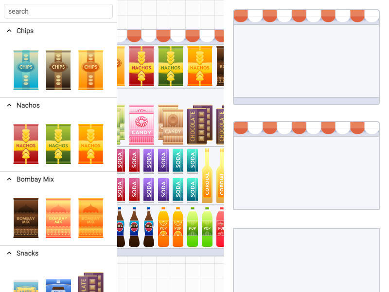

# JointJS+: Planogram 

The Planogram demo is a useful example of a visual application built with JointJS+. It uses some key plugins such as FreeTransform and PaperScroller to create an application that aims to help retailers better organize their brick-and-mortar stores and ultimately maximize sales.

This demo is also available online at [jointjs.com](https://jointjs.com/demos/planogram).

## Available Versions

- [JavaScript](./js/)
- [TypeScript](./ts/)

## Screenshot

