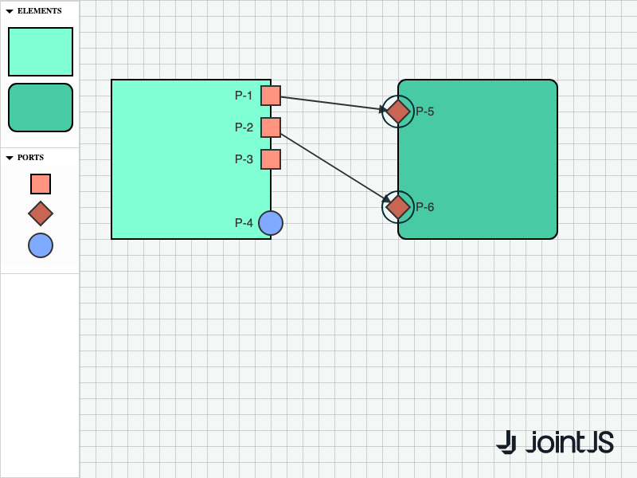

# JointJS+: Port Drag & Drop 

Do you want to list ports in your stencil and let the user drag and drop them into the elements? Do you want the user to be able to edit the position of the ports in the element later? Or remove a port with a double click? Check out this demo.

This demo is also available online at [jointjs.com](https://jointjs.com/demos/port-drag-drop).

## Available Versions

- [JavaScript](./js/)

## Screenshot

