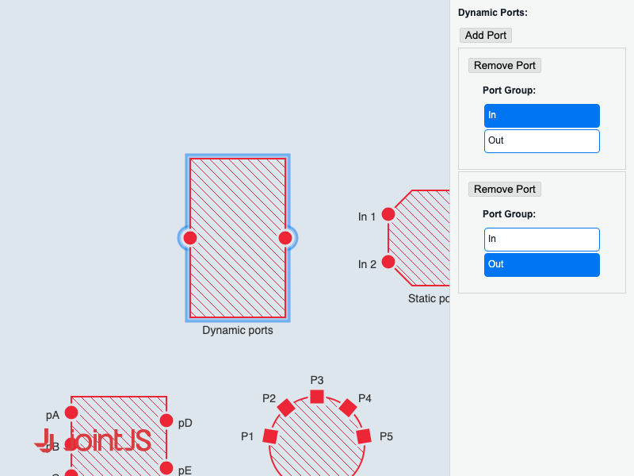

# JointJS+: Port Inspector 

Everything you wanted to know about configuring the port inspector and were afraid to ask, you can now find in this demo. Uncover these features in our application below: dynamically add or remove ports, tailor individual ports or a group of ports, customize port arrangements and labels, finely adjust port positioning and orientation, define whether a port can be connected to other ports, alter port shapes for specific ports or entire groups, rearrange the stacking order of ports, and modify diverse port visual attributes. As an extra benefit, the custom inspector will highlight ports when you hover over the inspector field related to that port.

This demo is also available online at [jointjs.com](https://jointjs.com/demos/port-inspector).

## Available Versions

- [JavaScript](./js/)

## Screenshot

