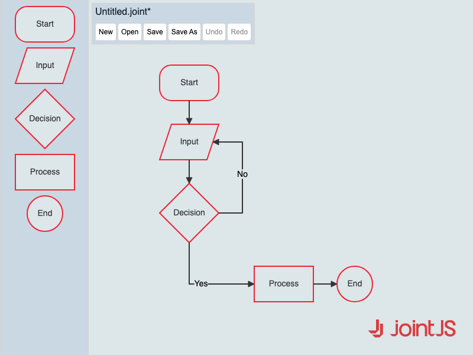

# JointJS: Saving and Loading Using File System Access API

Wondering how to allow users to save and load diagrams from the local file system? Check out the integration with the File System Access API to help accomplish this.

This demo is also available online at [jointjs.com](https://jointjs.com/demos/saving-and-loading-using-file-system-access-api).

## Available Versions

- [JavaScript](./js/)

## Screenshot

