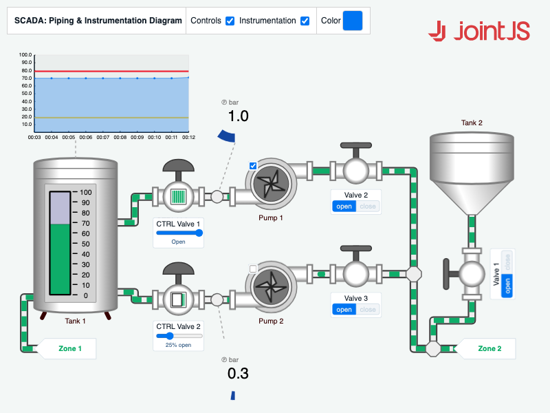

# JointJS+: SCADA (Piping and Instrumentation Diagram) 

Piping and Instrumentation Diagrams (P&IDs) are integral components of Supervisory Control and Data Acquisition (SCADA) systems, providing a visual representation of the interconnected piping, equipment, and instrumentation in industrial processes. By incorporating real-time data and interactive features, P&IDs enhance the monitoring, control, and maintenance capabilities of SCADA systems, contributing to the efficient and safe operation of complex industrial facilities.

This demo is also available online at [jointjs.com](https://jointjs.com/demos/scada).

## Available Versions

- [JavaScript](./js/)

## Screenshot

