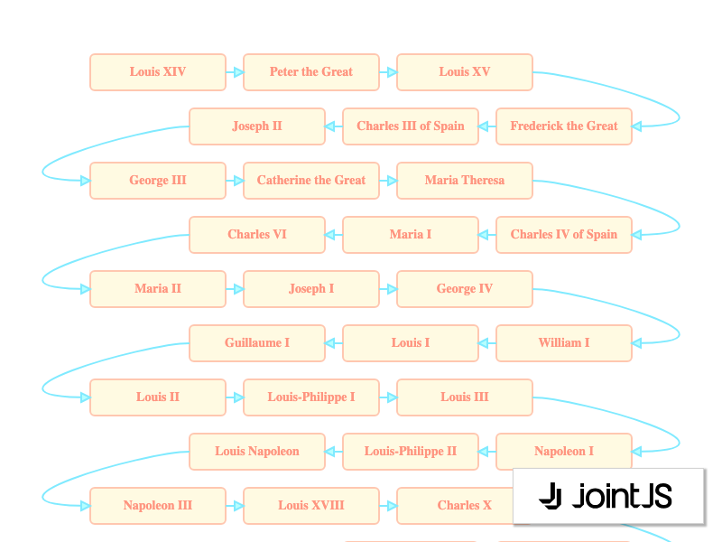

# JointJS: Serpentine Layout

This demo is an example of a serpentine layout, a custom layout where the elements are arranged in a zigzag pattern, where the rows are filled alternately from left to right and right to left, and where the rows fit the given width.

This demo is also available online at [jointjs.com](https://jointjs.com/demos/serpentine-layout).

## Available Versions

- [JavaScript](./js/)

## Screenshot

