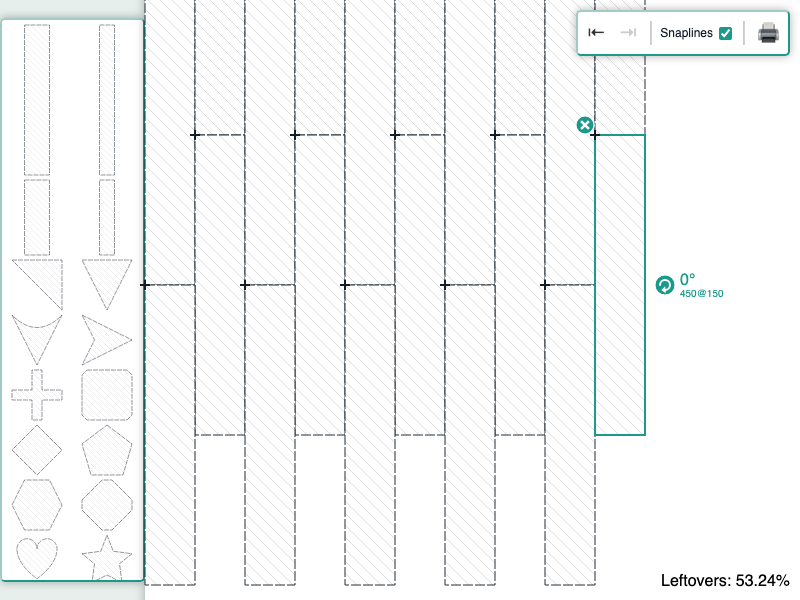

# JointJS+: Sheet Cutting 

The Sheet Cutting application is a powerful solution for generating and optimizing cutting plans for material sheets. It efficiently detects overlapping elements that could lead to issues during cutting and provides clear notifications to the user.

This demo is also available online at [jointjs.com](https://jointjs.com/demos/sheet-cutting).

## Available Versions

- [JavaScript](./js/)
- [TypeScript](./ts/)

## Screenshot

