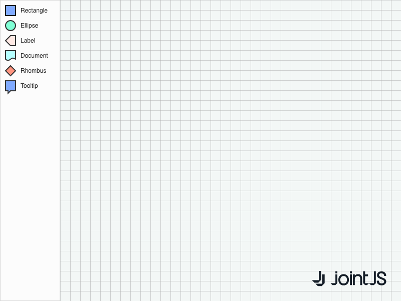

# JointJS+: Stencil vs Diagram Elements 

Are you looking for a way to represent stencil elements in a way other than their actual appearance in the diagram? Check out this demo example that shows a different representation of elements during the drag-n-drop sequence (template-preview-diagram).

This demo is also available online at [jointjs.com](https://jointjs.com/demos/stencil-vs-diagram-elements).

## Available Versions

- [JavaScript](./js/)

## Screenshot

