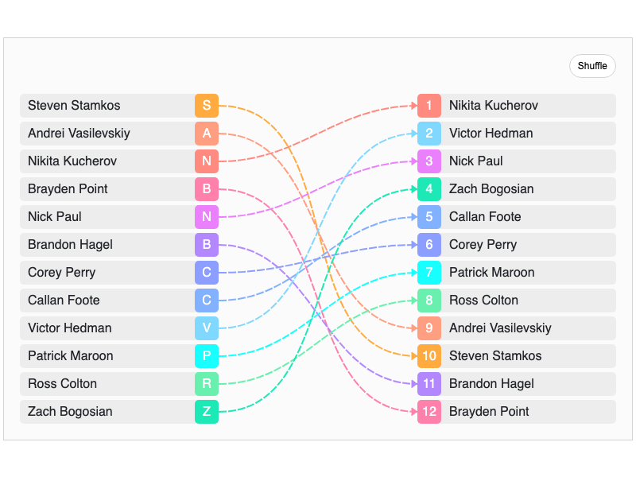

# JointJS+: Team Order 

Do you need to form pairs from a list of team members? Take inspiration from this demo app that utilizes a JointJS+ StackLayout to map team members together in pairs with an identifier label - randomly create pairs with the ability to manually change the order (using the drag and drop feature).

This demo is also available online at [jointjs.com](https://jointjs.com/demos/team-order).

## Available Versions

- [JavaScript](./js/)
- [TypeScript](./ts/)

## Screenshot

