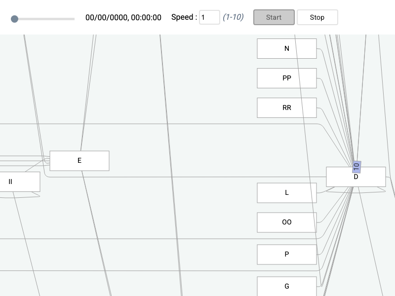

# JointJS+: Tokens 

The Tokens demo showcases visualization of Token events between nodes, and their transitions over time.

This demo is also available online at [jointjs.com](https://jointjs.com/demos/tokens).

## Available Versions

- [JavaScript](./js/)
- [TypeScript](./ts/)

## Screenshot

