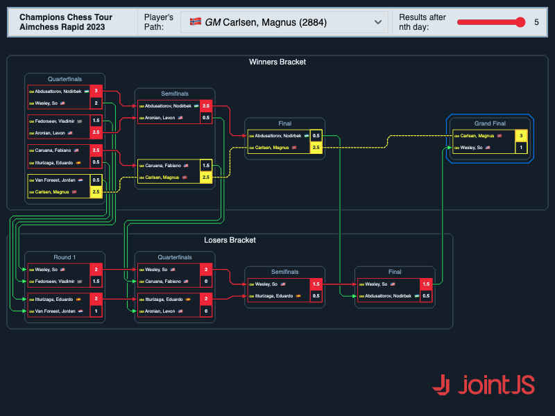

# JointJS+: Tournament brackets 

If you watched the latest Champions Chess Tournament, you know that the tournament followed a double elimination system, giving participants an equal chance to prove their skills and possibly recover from a single loss. This 2-bracket system is optimal for a visual representation in a form of a JointJS diagram, which is illustrated in the demo below.

This demo is also available online at [jointjs.com](https://jointjs.com/demos/tournament-brackets).

## Available Versions

- [JavaScript](./js/)

## Screenshot

